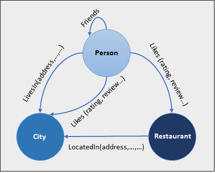

## Bases de Données Orientées Graphes

### Structure:

	La base de données orientée graphes est structurés sous forme noeuds-arcs.
chaque noeud représente une donnée ayant une étiquette ainsi que les arcs représentent les relations entre les données (noeuds).

		

### 