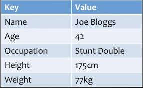
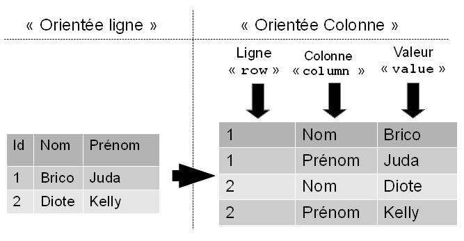
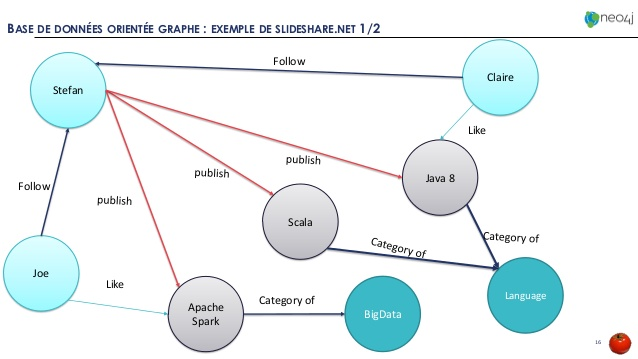

# TutorielNoSQL

Vous avez une connaissance en bases de données relationnelles et vous désirez savoir quelles différences y-a-t-il entre SQL et non SQL?
Ce tutoriel explique le NoSQL et ses différents types.

## Definition

Le NoSQL est apparu pour résoudre un des problèmes des bases de données relationnelles: la perte de performance lorsque l'on doit traiter un très gros volume de données.
De plus, le NoSQL permet de modeler les données d'une façon plus flexible.
Le NoSql n'utilise pas SQL pour manipuler des données.

## Les Familles de NoSQL

Le NoSQL regroupe 4 grandes familles de bases de données qui diffèrent par la manière de stockage des données.

### Les bases de données clé-valeur:

Le but de la famille clé-valeur est l'efficacité et la simplicité. 

Un système clé-valeur agit comme une énorme table de hachage distribuée sur le réseau. 

Tout repose sur le couple Clé/Valeur. La clé identifie la donnée de manière unique et permet de la gérer. La valeur contient n'importe quel type de données.

Il n'y ait ni schéma, ni structure pour le stockage. D'un point de vue de bases de données, il n'y a pas la possibilité d'exploiter ni de contrôler la structure des données.

vous cherchez (la clé) et vous manipulez directement la valeur.

### Les bases de données orientées Colonnes:

Ce genre de bases de données permet le stockage des données sous formes de colonnes au lieu de lignes.

### Les bases de données orientées Documents:

Le but des bases de données orientées documents est de manipuler des documents contenant des informations avec une structure complexe (types, listes, imbrications).

### Les bases de données orientées Graphes:

Ce modèle structure les données sous forme de graphe. C’est à dire un ensemble de nœuds qui peuvent être reliés entre eux par des arcs.

